# SweetShop

Welcome to **Sweet Shop**, a premium Sweet Shop Management application showcasing full-stack development with modern technologies, test-driven development, and clean code practices.


---

## 📋 Table of Contents
- [Project Description](#-project-description)
- [Features](#-features)
- [Tech Stack](#-tech-stack)
- [Screenshots](#-screenshots)
- [Hosting Information](#-hosting)
- [Setup Instructions](#-setup-instructions)
- [Testing](#-testing)
- [Troubleshooting](#-troubleshooting)
- [My AI Usage](#-my-ai-usage)
- [Project Structure](#-project-structure)

---

## 📖 Project Description

**Sweet Shop** is a full-stack web application for managing and selling sweets. The system includes user authentication, sweet inventory management, search/filtering, and role-based access control for admin operations.


## ✨ Features

### User Features
- 🔐 User registration and login with JWT authentication
- 🍬 Browse available sweets with beautiful card layouts
- 🔍 Search and filter sweets by name, category, and price range
- 🛒 Purchase sweets (decreases inventory quantity)
- 📊 Responsive dashboard showing sweet inventory

### Admin Features
- ➕ Add new sweets to inventory
- ✏️ Update sweet details (name, category, price, quantity)
- 🗑️ Delete sweets from inventory
- 📦 Restock sweets (increase quantity)
- 👥 Role-based access control

### Sweet Categories
- 🍫 Chocolate
- 🥮 Swiss Western
- 🪔 Festival Specials
- 🌰 Premium Dry Fruit
- 🏛️ Regional Traditional

---

## 🛠️ Tech Stack

### Backend
- **Language**: TypeScript
- **Framework**: Express.js
- **Database**: MongoDB (Mongoose ODM)
- **Authentication**: JWT (jsonwebtoken) + bcrypt
- **Validation**: express-validator
- **Testing**: Jest, MongoDB Memory Server
- **Dev Tools**: ts-node-dev, ESLint

### Frontend
- **Framework**: React 19
- **Language**: TypeScript
- **Bundler**: Vite
- **Styling**: Tailwind CSS 4
- **State**: Redux Toolkit
- **HTTP Client**: Axios
- **Routing**: React Router v7
- **Notifications**: react-hot-toast

---

## 📸 Screenshots

### User Features

#### Home Page
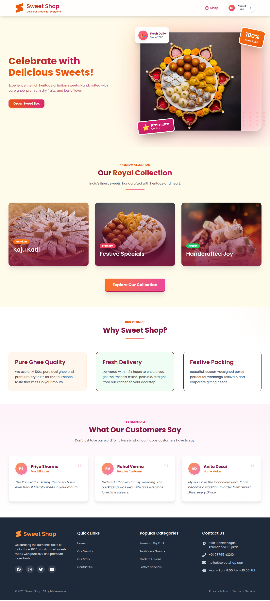
*Welcome screen featuring Indian-inspired design with saffron and royal color theme. Showcases featured sweets in an attractive card layout.*

#### Register Page
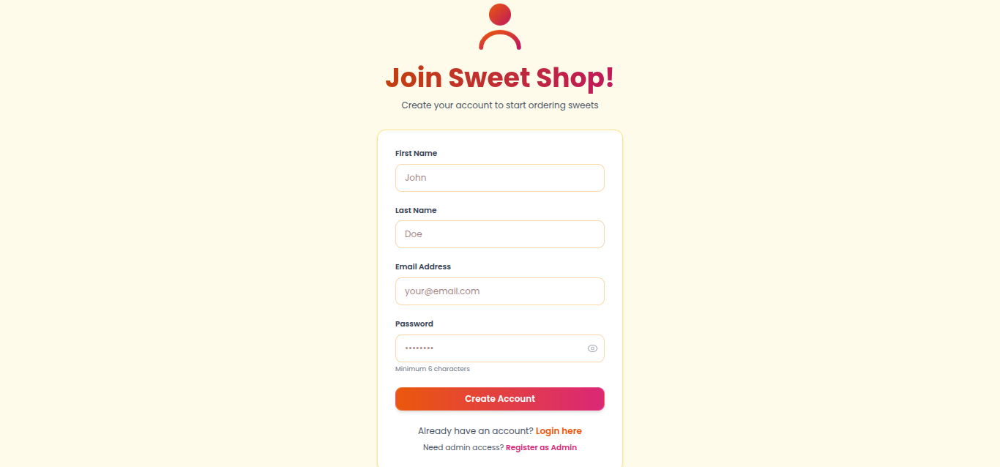
*Clean registration interface with form validation. Implements secure password requirements and email verification.*

#### Login Page
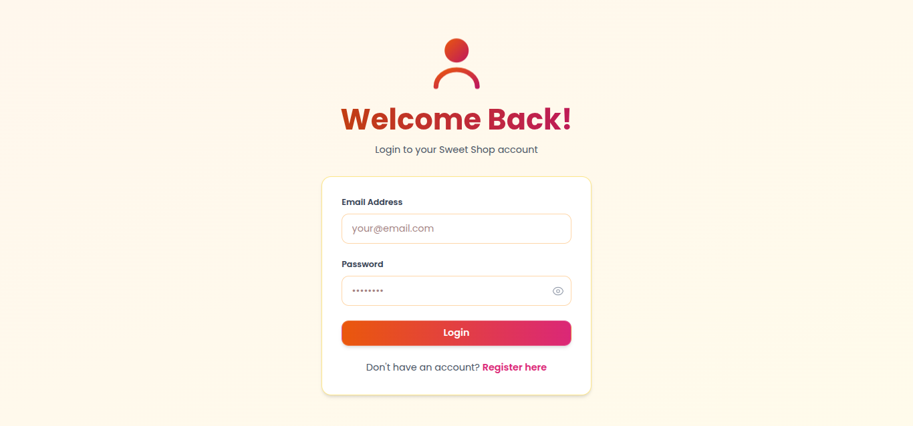
*Secure authentication page with JWT token management. Includes "Remember Me" functionality and error handling.*

#### Shop Page
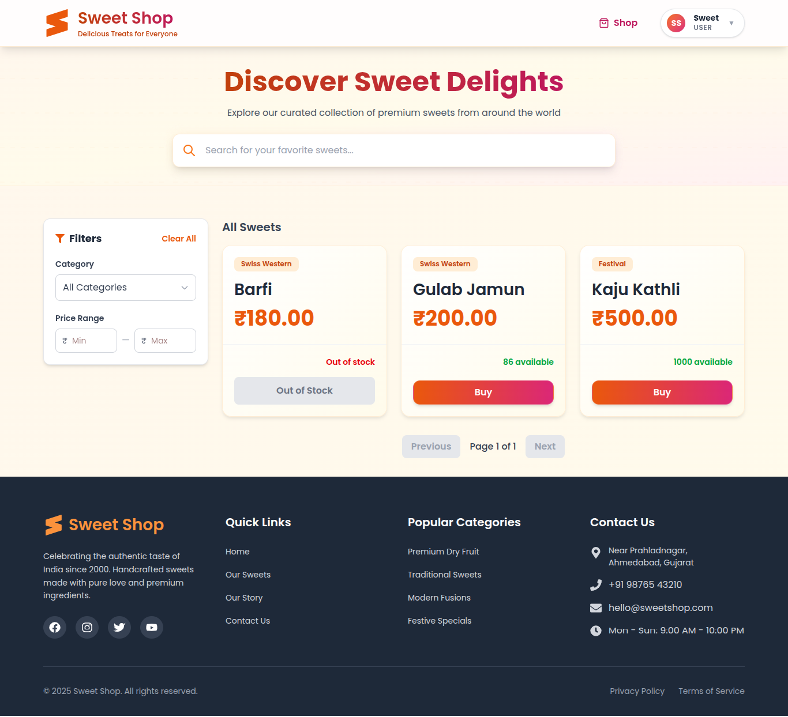
*Main shopping interface displaying all available sweets in responsive grid layout. Each card shows sweet details with price and availability.*

#### Filter & Search
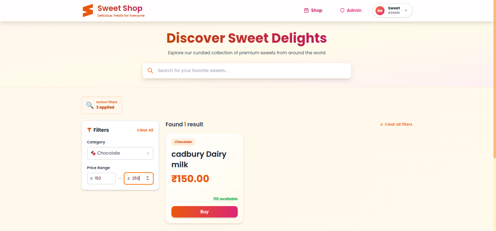
*Advanced filtering system allowing users to search by name, filter by category (Chocolate, Festival Specials, etc.), and set price ranges for precise product discovery.*

#### Orders
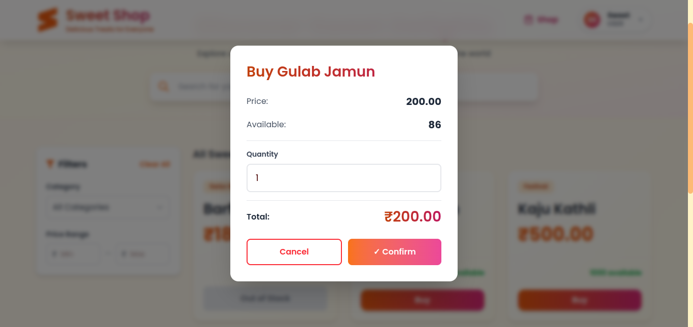
*Order history page showing purchase details, quantities, and timestamps. Users can track their sweet purchases.*

#### Purchase Successful
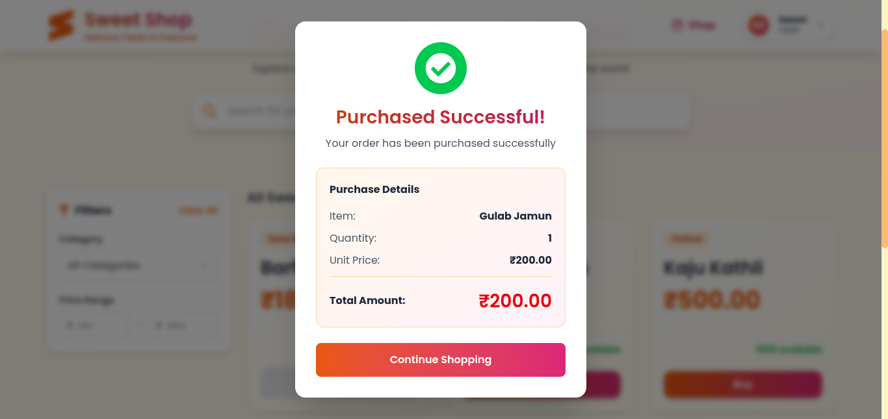
*Confirmation screen after successful purchase with order details. Includes automatic inventory update and toast notification.*

---

### Admin Features

#### Admin Dashboard
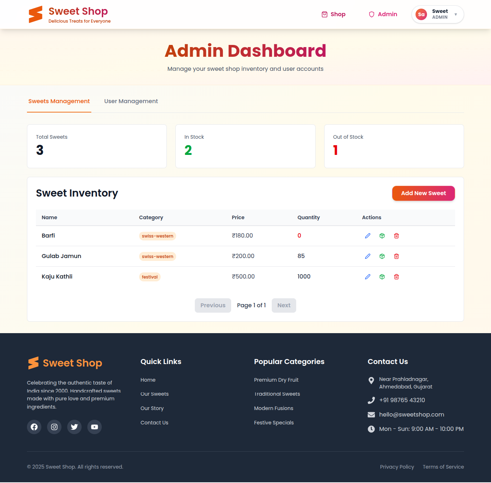
*Comprehensive admin panel with inventory statistics, total sweets count, and quick action buttons. Features full CRUD operations for sweet management.*

#### Admin User Management
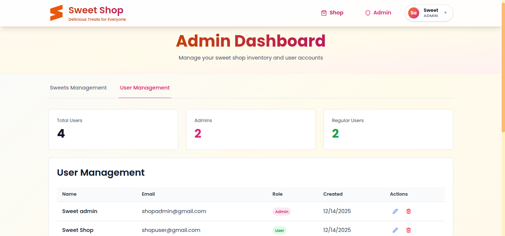
*User management interface showing registered users, their roles, and account status. Admins can view user activity and statistics.*

#### Add Sweet
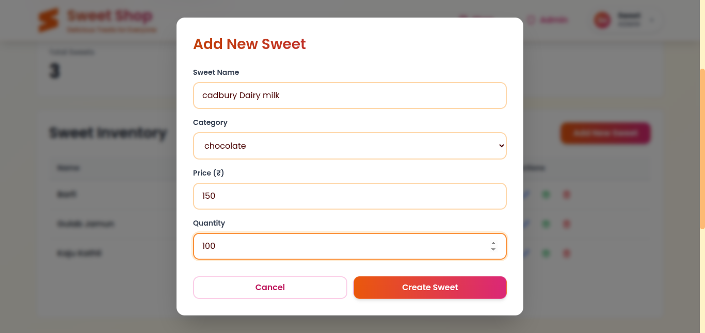
*Form for adding new sweets with fields for name, category, price, quantity, and description. Includes image upload and validation.*

#### Restore Admin
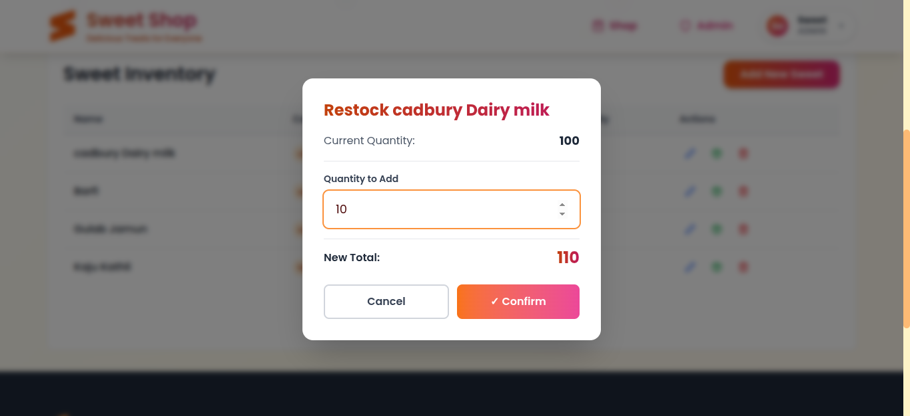
*Admin restoration feature allowing recovery of deleted items or resetting admin privileges for system maintenance.*

---

## 🌐 Hosting
🔗 **Live Application**: [http://13.200.251.129/](http://13.200.251.129/)

The application is hosted on **AWS EC2** in the Asia Pacific (Mumbai) region.

---

## 🚀 Setup Instructions

### Prerequisites
- **Node.js**: v18 or higher
- **MongoDB**: MongoDB Atlas account (or local MongoDB)
- **Git**: For version control

### 1. Clone the Repository
```bash
git clone https://github.com/abhayparmar05/SweetShop.git
cd SweetShop
```

### 2. Backend Setup

1. Navigate to backend directory:
   ```bash
   cd backend
   ```

2. Install dependencies:
   ```bash
   npm install
   ```

3. **Create `.env` file** in `backend/` directory:
   ```env
   # Server Configuration
   PORT=5000
   NODE_ENV=development

   # MongoDB Configuration (REPLACE WITH YOUR CREDENTIALS)
   MONGODB_URI=mongo-URI

   # JWT Secrets
   ACCESS_TOKEN_SECRET=your-access-token-secret
   REFRESH_TOKEN_SECRET=your-refresh-token-secret
   
   # Token Expiry
   ACCESS_TOKEN_EXPIRY=15m
   REFRESH_TOKEN_EXPIRY=7d

   # CORS
   CORS_ORIGIN=http://localhost:5173
   ```

4. Run the backend server:
   ```bash
   npm run dev
   ```
   Server will start on `http://localhost:5000`

5. **(Optional)** Run tests:
   ```bash
   npm test
   ```

### 3. Frontend Setup

1. Navigate to frontend directory:
   ```bash
   cd ../frontend
   ```

2. Install dependencies:
   ```bash
   npm install
   ```

3. **(Optional)** Create `.env` file in `frontend/` directory:
   ```env
   VITE_API_BASE_URL=http://localhost:5000/api
   ```

4. Run the frontend development server:
   ```bash
   npm run dev
   ```
   Application will open at `http://localhost:5173`

### 4. Access the Application

- **Frontend**: http://localhost:5173
- **Backend API**: http://localhost:5000/api

---

## Testing

This project includes comprehensive automated test suites for both frontend and backend to ensure code quality, reliability, and maintainability.

### Backend Tests

**Test Framework**: Jest with TypeScript  
**Test Database**: MongoDB Memory Server (in-memory database for isolated testing)  
**Total Test Suites**: 4  
**Total Tests**: 65  
**Status**: ✅ **All 65 tests passing**

#### Running Backend Tests

```bash
cd backend

# Run all tests
npm test

# Run tests in watch mode
npm run test:watch

# Run tests with coverage report
npm run test:coverage
```

---

### Frontend Tests

**Test Framework**: Vitest with React Testing Library  
**Test Renderer**: jsdom  
**Total Test Suites**: 4  
**Total Tests**: 33  
**Status**: ✅ **All 33 tests passing**

#### Running Frontend Tests

```bash
cd frontend

# Run all tests (single run)
npm test -- --run

# Run tests in watch mode (auto re-run on changes)
npm test

# Run tests with UI interface
npm run test:ui

# Run tests with coverage report
npm run test:coverage -- --run
```

---

## 🔧 Troubleshooting

### Common Issues and Solutions

#### MongoDB Connection Error
**Problem**: `MongooseServerSelectionError: connect ECONNREFUSED`

**Solution**:
- Verify your MongoDB Atlas cluster is active
- Check `MONGODB_URI` in backend `.env` file is correct
- Ensure your IP address is whitelisted in MongoDB Atlas Network Access
- Test connection string in MongoDB Compass first

#### CORS Error in Browser
**Problem**: `Access to XMLHttpRequest blocked by CORS policy`

**Solution**:
```env
# In backend/.env, ensure:
CORS_ORIGIN=http://localhost:5173
```
- Restart backend server after changing `.env`
- Clear browser cache and hard reload (Ctrl+Shift+R)

#### Port Already in Use
**Problem**: `Error: listen EADDRINUSE: address already in use :::5000`

**Solution**:
```bash
# Find and kill process using port 5000
lsof -ti:5000 | xargs kill -9

# Or change port in backend/.env
PORT=5001
```

#### Frontend Not Loading API Data
**Problem**: Data not appearing on frontend, console shows 401 errors

**Solution**:
- Verify backend server is running on `http://localhost:5000`
- Check `VITE_API_BASE_URL` in frontend `.env` (if created)
- Clear browser localStorage: `localStorage.clear()` in browser console
- Ensure you're logged in (JWT token must be valid)

#### Tests Failing
**Problem**: Jest tests not running or failing

**Solution**:
```bash
# Clear Jest cache
cd backend
npx jest --clearCache

# Reinstall dependencies
rm -rf node_modules package-lock.json
npm install
npm test
```

#### Environment Variables Not Loading
**Problem**: Application can't read `.env` variables

**Solution**:
- Ensure `.env` file is in the **correct directory** (backend/ or frontend/)
- File must be named exactly `.env` (not `.env.example`)
- Restart server after creating/modifying `.env`
- Never commit `.env` to git (it's in `.gitignore`)

---

## 🤖 My AI Usage

### AI Tools Used

**Google Gemini 3 Pro** - AI assistant for code suggestions, debugging support, and documentation assistance

### How I Used AI

I used Gemini 3 Pro as a **development assistant** to enhance my productivity while maintaining full control over the codebase. The AI served as a helpful tool, not the primary developer.

#### Backend Development

**Architecture & Setup**
- Designed the MVC architecture for Express + TypeScript backend
- Used Gemini for boilerplate code suggestions (models, controllers, routes)
- Manually implemented business logic for User and Sweet models
- Configured MongoDB connection and environment variables myself
- AI suggested best practices for TypeScript configurations

**Authentication System**
- Designed the JWT authentication flow and security requirements
- Implemented the auth middleware and token generation logic
- Used Gemini to review security practices (password hashing, token expiry)
- Personally debugged token refresh flow and session management
- Wrote error handling and validation logic

**API Development**
- Designed all REST API endpoints (CRUD operations, search, filters)
- Implemented controllers and service layer architecture
- Used AI for syntax suggestions and TypeScript type definitions
- Manually tested all endpoints with different edge cases
- Optimized MongoDB queries for performance

**Testing**
- Wrote test strategy and identified test scenarios
- Implemented Jest test suites with MongoDB Memory Server
- Used Gemini to suggest additional edge cases
- Debugged failing tests and fixed async/await issues manually
- Achieved 60% test coverage through iterative testing

#### Frontend Development

**Project Structure**
- Set up React 19 + TypeScript + Vite project structure
- Configured Tailwind CSS 4 with custom theme colors
- Designed component hierarchy and routing architecture
- AI helped with initial Vite configuration recommendations

**UI/UX Design**
- Designed the Indian sweet shop theme (saffron, royal, pistachio colors)
- Created responsive layouts for 4 breakpoints (mobile to desktop)
- Implemented all React components with proper state management
- Used Gemini for CSS suggestions and Tailwind utility recommendations
- Manually refined animations and user interactions

**State Management**
- Architected Redux Toolkit store structure
- Implemented auth and UI slices with proper TypeScript types
- Used AI to review type definitions for reducers and actions
- Debugged state update issues and optimized re-renders
- Integrated API calls with Redux async thunks

**Integration & Debugging**
- Configured Axios interceptors for JWT token handling
- Implemented error handling and toast notifications
- Debugged CORS issues and API integration problems manually
- Used Gemini to suggest solutions for TypeScript compilation errors
- Tested all user flows and fixed bugs iteratively

### My Role in Development

**Developer Contributions (Primary Work):**
- ✅ Complete system architecture and design decisions
- ✅ All business logic implementation
- ✅ Database schema design and optimization
- ✅ Manual testing and quality assurance
- ✅ Security implementation (authentication, authorization)
- ✅ API endpoint design and integration
- ✅ UI/UX design and responsive layouts
- ✅ State management architecture
- ✅ Debugging and problem-solving
- ✅ Git version control and project organization

**AI Assistance (Supporting Role):**
- 🤖 Boilerplate structure for backend & frontend
- 🤖 Syntax and TypeScript type recommendations
- 🤖 Documentation and formatting suggestions
- 🤖 Edge case identification for testing
- 🤖 Test case generation for backend and frontend
- 🤖 Responsive design and theme recommendations
- 🤖 README.md documentation assistance

---

## 📂 Project Structure

```
SweetShop/
├── backend/
│   ├── src/
│   │   ├── __tests__/           # Integration tests
│   │   ├── config/              # Environment & DB config
│   │   ├── controllers/         # Request handlers
│   │   ├── middleware/          # Auth, validation, error handling
│   │   ├── models/              # Mongoose schemas
│   │   ├── routes/              # API routes
│   │   ├── services/            # Business logic
│   │   ├── app.ts               # Express app setup
│   │   └── server.ts            # Server entry point
│   ├── package.json
│   └── tsconfig.json
│
├── frontend/
│   ├── src/
│   │   ├── api/                 # Axios API clients
│   │   ├── components/          # React components
│   │   ├── hooks/               # Custom hooks
│   │   ├── pages/               # Page components
│   │   ├── store/               # Redux slices
│   │   ├── types/               # TypeScript interfaces
│   │   ├── App.tsx
│   │   └── main.tsx
│   ├── package.json
│   └── vite.config.ts
│
├── docs/
│   └── screenshots/             # Application screenshots
│
├── README.md
└── TEST_REPORT.md
```

---

## 👨‍💻 Author

**Abhay Parmar**
- GitHub: [@abhayparmar05](https://github.com/abhayparmar05)
- Email: abhayparmar587@gmail.com

---

## 📄 License

This project was created as part of a coding assessment.

---

## 🙏 Acknowledgments

- **Incubytes** for the comprehensive assignment requirements
- **Google Gemini AI** for pair programming assistance
